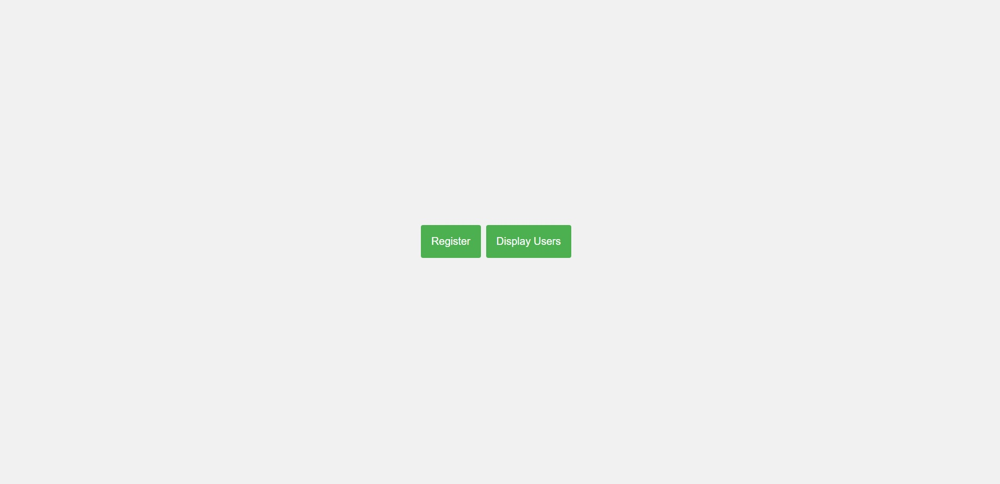
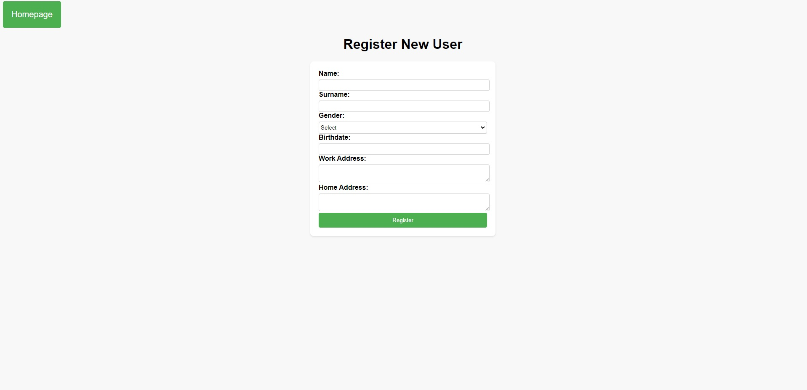
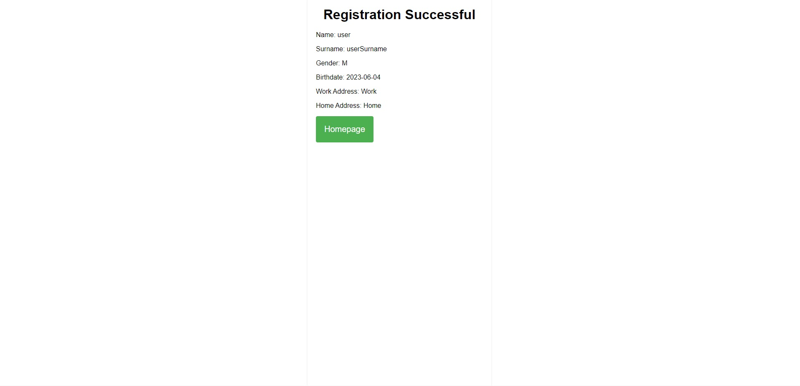
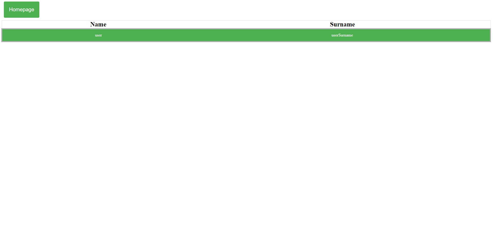

# Simple Web Application

This is a simple web application that allows users to register and display user information. It is built using Java Server Pages (JSP) and Servlets, with a MySQL database for data storage. The application has three main pages: Homepage, Register New User, and Display Users.

## Table of Contents

- [Homepage](#homepage)
- [Register New User](#register-new-user)
- [Display Users](#display-users)
- [Tools used](#tools-used)
- [Installation and Setup](#installation-and-setup)
- [Presenation of the Project](#presentation-of-the-project)

## Homepage

The Homepage is the starting point of the application. It presents a menu with two options: Display Users and Register New User. Users can select any option to navigate to the respective page.

## Register New User

The Register New User page allows users to fill in a form with their personal information. The form includes the following fields:

- Name (Textfield - Mandatory)
- Surname (Textfield - Mandatory)
- Gender (Drop-down list with options M/F - Mandatory)
- Birthdate (Date - Mandatory. A JS datepicker is used for ease of selection)
- Work Address (Text area - Non-mandatory)
- Home Address (Text area - Non-mandatory)

Users must provide mandatory information and perform validation before submitting the form. Upon submission, the user details are stored in a MySQL database. The work address and home address are stored in a separate table in the database.

## Display Users

The Display Users page presents a list of user data in a tabular format with two columns: Name and Surname. Clicking on a specific user record will open a new tab displaying all the details of that user.

## Technical Specifications

The technical specifications of this web application are as follows:

- Presentation layer: Java Server Pages (JSP) & Servlets
- Server/Backend: Tomcat
- DBMS: MySQL

## Tools used

The following tools were used in this project:

- Visual Studio Code (VSCode) with the following extensions:
  - Community Server Connectors v0.26.13
  - Debugger for Java v0.51.0
  - Extension Pack for Java v0.25.11
  - Maven for Java v0.41.0
- JDK (Java Development Kit)
- Maven
- MySQL
- Apache Tomcat

## Installation and Setup

To run and configure the project, please follow these steps:

1. Install JDK, Maven, MySQL, and Apache Tomcat on your computer.
2. Clone the project repository to your local machine.
3. Open the project in Visual Studio Code.
4. Install the required extensions listed above.
5. Configure the database connection details in the project configuration.
6. Create the necessary database tables by executing the following SQL statements:

```sql
CREATE TABLE addresses (
  id INT PRIMARY KEY AUTO_INCREMENT,
  user_id VARCHAR(36) NOT NULL,
  workAddress TEXT,
  homeAddress TEXT,
  FOREIGN KEY (user_id) REFERENCES users(id)
);

CREATE TABLE users (
  id VARCHAR(36) PRIMARY KEY,
  name VARCHAR(50) NOT NULL,
  surname VARCHAR(50) NOT NULL,
  gender ENUM('M', 'F') NOT NULL,
  birthdate DATE NOT NULL
);
```

## Presenation of the Project






